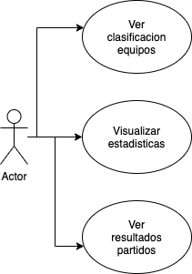

# LaLiga Web v 1.0

Descripcion de LaLiga Web

## Descripcion funcional

Las caracteristicas principales de la web son las siguientes:
- Visualizacion resultados
- Seleccion equipos
- ...

### Casos de uso (www.draw.io)

## Descripcion técnica

Realizar descripción de algunas de las funciones:

- La funcion x recibe el parametro "p" y devuelve el parametro "w".

## Tecnologías

- HTML
- CSS
- Boostrap
- Vanilla JS

## Versiones:
v.1.1 Añadido ligas extranjeras (23/02/21)

## To Do:

Cosas pendientes que queden por hacer