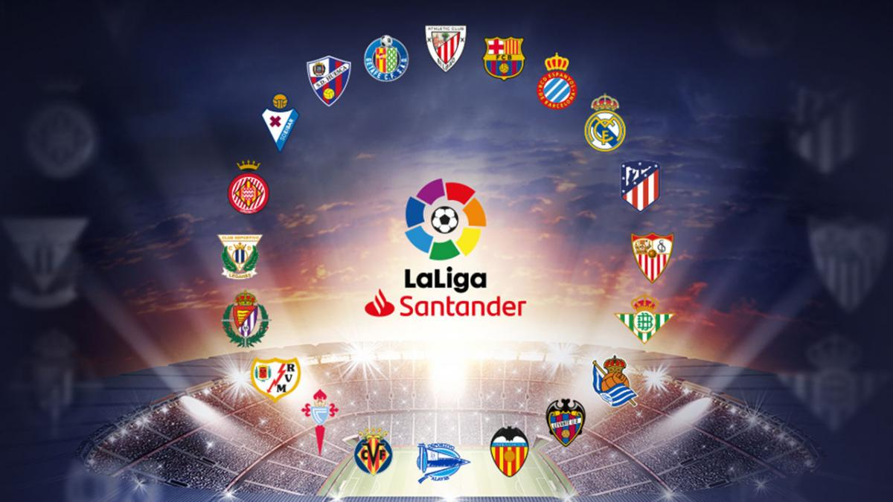
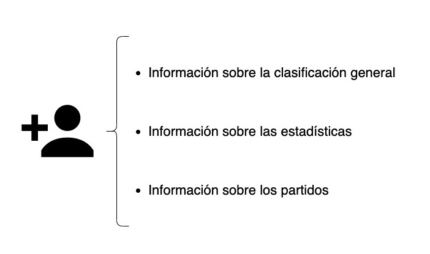
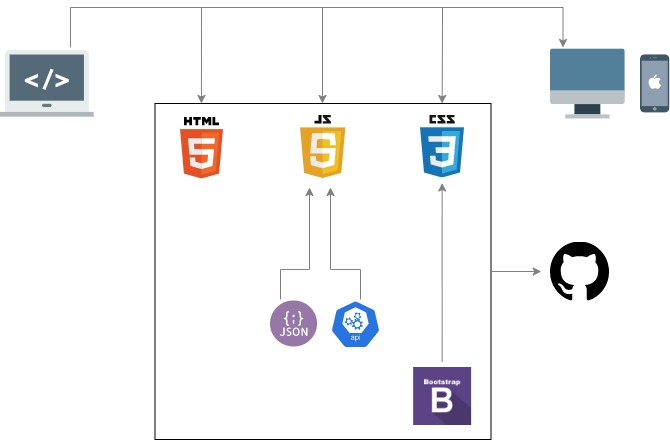

# LaLiga Web v 1.0

## Descripción de LaLiga Web

LaLiga Web consiste en un proyecto mediante el cual se facilita al usuario el acceso a distintos datos sobre los equipos, la clasificación, los partidos y las estadísticas de la Primera División de la competición nacional de futbol española.

Además facilita al usuario el acceso a las páginas web de los distintos equipos que conforman esta competición y una visualización rápida de las últimas noticias que LaLiga publica en su cuenta de Twitter.

## Descripción funcional

Las utilidades principales de la web son las siguientes:
- Acceso a todas las webs de los equipos y al feed de Twitter.
- Visualizacion de la clasificación general.
- Visualización de las estadísticas de los equipos, en concreto: los cinco equipos con mejor media de goles marcados y los cinco equipos con menor número de goles recibidos jugando como visitante.
- Visualización de los resultados de los partidos. Estos pueden ser filtrados según el equipo que interese al usuario, asi como ser filtrados por el resultado final del mismo.

### Casos de uso (www.draw.io):

## Descripción técnica

El proyecto consta de distintas funcionalidades, algunas genéricas y otras específicas.

Como genéricas podemos mencionar:

- function fetch(): La obtención de datos desde una API externa haciendo uso de la función fetch. Esto permite que toda la información sea a tiempo real. 

- function crearTabla(): La creacion de tablas dinámicas, creadas a partir de los datos de la API, de tal manera, que si quisieramos realizar el mismo proyecto para competiciones de otros paises, bastaria con cambiar un solo dato y seguiría siendo igual de funcional.

Entre las funciones mas específicas nos encontramos con:

- function filtros(): Permite acceder a los resultados de los partidos según la selección que realiza previamente el usuario desde el formulario creado en HTML. La función de crearTabla(), es modificada por estos datos ya filtrados, mostrando asi, exclusivamente la información que solicita el usuario.

- function crearDesplegable(): Con ella creamos parte del formulario. La elección del equipo la realiza el usuario desde este desplegable, el cual esta formado por un listado de los equipos obtenido desde los datos de la API, por lo que si la competición fuera de otro país, estos equipos cambiarian automaticamente, tanto en la tabla como en el desplegable.

- function estadísticas(): Para esta funcionalidad, primero se han de descartar aquellos partidos que aun no han sido jugados. A partir de ahí, declarar las variables con los datos necesarios para poder realizar los cálculos, en este caso, partidos y goles. Una vez obtenidos los resultados de las estadísticas, la función debe acortar la array final para que la función crearTabla() muestre únicamente los cinco resultados que nos interesan en cada caso.

Se ha de remarcar la importancia a la hora de pasar parámetros de unas funciones a otras y en que orden pasárselos. Si queremos la tabla completa desde un primer momento y que luego se modifique según los filtros o si queremos que directamente la tabla que se cree, contenga exclusivamente los datos que nos interesan y sea en cierta manera "estática".

## Tecnologías

Para este proyecto, se han utilizado las siguientes tecnologías de desarrollo web:

- HTML: para realizar el esqueleto del proyecto.
- CSS: para que el estilo sea visualmente agradable para el usuario.
- Boostrap: como nueva herramienta para facilitar la creación de elementos y estilos.
- Vanilla JS: para darle al proyecto la funcionalidad necesaria.
- GitHub: repositorio remoto para trabajar desde distintas branches.
- API y Json: bases de datos externas que proveen la información mostrada en la web.

## Versiones:
v.1.0 Primera Version (23/02/21)

## To Do:

Filtrado a partir de jornadas (crear nuevo <select>)